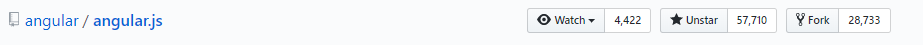
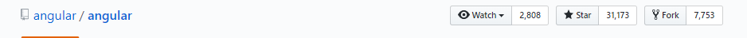

### czym jest 

#  React?

---

## Trochę kontekstu historycznego

- Stworzony przez wewnątrz facebooka (~2011) |
- Facebook miał wtedy problemy z ich dotychczasowym MVC frameworkiem BoltJS |
- Tymczasem pracownik facebooka Jordan Walke pracował nad swoim projektem bocznym FaxJS który rozwiązywał te same problemy co BoltJS jednak w inny sposób |
- BoltJS + FaxJS = FBolt |
- Po pewnym czasie nazwa została zmieniona do React. |

---

Jordan Walke o nazwie React: 

  > [...] Wiele systemów reklamuje sobie "Reaktywność" lecz zazwyczaj wymagają ustawienia ku temu jakichś punktów komunikacji. Nasze API "reaguje" (ang. react) do każdej zmiany stanu [...] i działa z danymi w każdym formacie (nie ważne jak głęboki jest graf danych) więc uważam, że nazwa pasuje.  

--- 

# 2013


<br>

@fa[fa-thumbs-o-up](React zostaje udostępniony do rąk mas na JSConfUS)

--- 

### Początkowo nie został ciepło przyjęty.

- "Co robi HTML/XML w moim javascripcie??"
- "Facebook próbuje wskrzesić XMLa!"
- "Gdzie jest two way data binding??"

---

### Lecz ewentualnie ludzie zobaczyli światło

- Angular 1.x 


- Angular Next


- React


--- 

# Więc o co tu chodzi,

### skąd ten sukces?

--- 

### React jest: 

- deterministyczny |
- skalowalny oraz wydajny | 
- upgradeowalny oraz kompatybilny wstecznie (w końcu sam facebook ma 30,000 komponentów!) | 
- świetnie odokumentowany. |

--- 

### Napiszmy swój pierwszy React komponent!

---

```javascript
  // business-card.js
  import React from "react";

  export function BusinessCard(props) {
    return (
      <div>
        hello my name is {props.name} <br />
        and I'm a {props.workPosition} <br />
        working for {props.compnay.name} 
      </div>
    );
  }

```

@[0-1](Stwórzmy sobie nowy plik)
@[1-2](Jeżeli tworzysz komponent to zawsze zaimportuj Reacta)
@[3-4](Nasz komponent będzię się nazywać BusinessCard)
@[5-11](Zwracamy reprezentancję naszego komponentu)

---

### Użyjmy naszego komponentu 

```javascript
  render() {
    return (
      <div>
        <BusinessCard
          name="Dawid C."
          workPosition="Programmer"
          company={{ name: "Unit-t", address: "[..]" }}
        />
        <BusinessCard
          name="John D."
          workPosition="HR"
          company={{ name: "Fictional", address: "[..]" }}
        />
      </div>
    );
  }
```

@[3-8](Używamy naszego nowego komponentu)
@[7-7](Tak podajemy obiekty)
@[9-13](Komponent może być do woli recyklingowany)

---

### Wszystko działa świetnie ale...

Dane w naszych aplikacjach zazwyczaj nie są na sztywno wpisane.

---

### Porozmawiajmy jeszcze raz o komponentach

- "Głupie", proste komponenty (ang. Dumb components), |
- Komponenty sterujące (ang. Controller components) |

---

### Głupie komponenty

- Ich reprezentacja zależy tylko i wyłącznie od propów do nich przekazanych |
- Łatwo testowalne |
- Chcesz mieć ich jak najwięcej |
- Kandydatami byłyby takie komponenty jak: Button, Modal, FancyImage itp |

---

### Komponenty sterujące

- Oprócz opcjonalnych propów, przetrzymują jakiś stan, |
- są bardziej złożone, |
- koordynują innymi komponentami. |
- Kandydatami byłyby takie komponenty jak: UserProfilePage, UserInputForm etc. |

---

#### Nasz pierwszy sterujący komponent

```javascript
// user-profile.js
import React, { Component } from "react";
import userApi from "api/userApi";

export class UserProfile extends Component {
  
  state = { 
    isFetching: true,
    userProfile: {}
  }

  componentDidMount() {
    userApi.fetchOne(1)
      .then(resp => {
        this.setState({ userProfile: resp.data, isFetching: false });
      });
  }

  render() { /* następny slajd */ }

}

```
@[0-3](Nigdy nie zapomnij importać reacta!)
@[4-5](Komponenty możemy tworzyć na dwa sposoby, ponieważ nasz komponent będzie potrzebować stanu użyliśmy "class" opartego konstruktu.)
@[7-11](Stan naszego komponentu)
@[12-12](Gdy komponent będzie gotowy...)
@[13-13](Pobierz użytkownika o Id: 1)
@[15-15](I zaktualizuj stan komponentu)


---
#### render(): JSX.Element

```javascript
  render() {
    const { userProfile } = this.state;

    return (
      <div>
        User profile #1 <br>
        {this.state.isFetching ? 
          <div>loading...</div> : 
          <BusinessCard
            name={userProfile.name}
            workPosition={userProfile.workPosition}
            company={userProfile.company}
          />}
          
      </div>
    );
  }
```

@[2-2](Wyciągnijmy sobie userProfile z stanu naszego komponentu (es6 feature))
@[7-7](Jeżeli state.isFetching jest prawdziwe to...)
@[8-8](Wyświetl napis "loading...")
@[9-13](Jeżeli nie jest "fetching" to wyrenderuj BusinessCard komponent)


---


### Czy mogę już wpisać reacta do CV?

<br>

***Nie.***. Całego reacta nie sposób omówić w jednej sesji. <br><br><br>
Co w tej prezentacji nie zostało umowione: 

- Bardziej głebokie hierarchie komponentów, |
- Sposoby podawania stanu do góry, |
- Client side routing, |
- Pozostały ekosystem. |

---

### Co dalej

Zadanie domowe:

- [https://reactjs.org/tutorial/tutorial.html](https://reactjs.org/tutorial/tutorial.html) 

Inne przypadne zasoby: 

- [https://www.youtube.com/watch?v=xsSnOQynTHs](https://www.youtube.com/watch?v=xsSnOQynTHs) Redux hot loading. 
- [https://www.youtube.com/watch?v=BF58ZJ1ZQxY](https://www.youtube.com/watch?v=BF58ZJ1ZQxY) Przepisywanie legacy aplikacji na Reacta.
- [https://www.youtube.com/watch?v=x7cQ3mrcKaY](https://www.youtube.com/watch?v=x7cQ3mrcKaY) Jedna z pierwszych i zarazem lepszych wstępnych prezetancji reacta. Zauważ jak "wiele" się zmieniło.

--- 

# Dziękuję za uwagę.